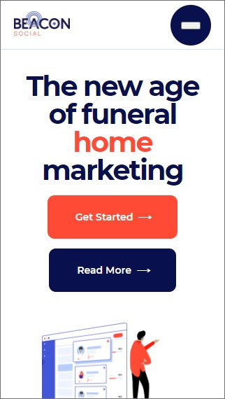

# Procesverslag
**Auteur:** Patrick van der Bijl (500823037)

## Bronnenlijst
1. -bron 1-
2. -bron 2-
3. -...-

## Eindgesprek (week 7/8)

-dit ging goed & dit was lastig-

**Screenshot(s):**

-screenshot(s) van je eindresultaat-

## Voortgang 3 (week 6)

-same as voortgang 1-

## Voortgang 2 (week 5)

### Stand van zaken

Deze week ben ik verder gegaan met het maken van de eerste sectie van de home-pagina. Het is met gelukt om alles in correct semantisch html te zetten alleen heb ik wel wat moeite met het positioneren van de elementen. Vooral de afbeeldingen zijn lastig om te positioneren aangezien ze ook een animatie nodig hebben.

**Screenshot(s):**

Voor dit eerste voortgangsgesprek was ik alleen nog toe gekomen aan de header en de eerste section. Hierboven zie je het resultaat tot nu toe.

### Agenda voor meeting

| Midas          | Moon            | Patrick         |
| ---            | ---             | ---             |
| Basis code     | Hover state     | Code check      |
| check          | en html code    | , positioneren  |
|                |                 | en animeren     |

### Verslag van meeting

Tijdens deze meeting heb ik weer even nagevraagd of mijn code correct is. Gelukkig was dit wel het geval. Echter had ik wel moeite met het positioneren van de afbeeldingen in de eerste sectie. Ik kwam er maar niet uit hoe ik deze het best boven elkaar kon zetten en ook nog eens kon animeren. Hier heb ik dus even hulp om gevraagd. Sanne gaf aan dat ik in dit geval wél een 
 kon gebruiken om de afbeeldingen te groeperen, zodat ik ze makkelijker kan positioneren. Dit geld dan voor de 
 zelf en de afbeeldingen in de 
. Daarnaast heeft Sanne mij geholpen met het animeren van de afbeeldingen. Deze moeten namelijk "infaden" wanneer de pagina wordt geladen.

## Voortgang 1 (week 3)

### Stand van zaken

Aangezien ik nog niet heel veel code had geschreven waren er ook niet veel opmerkingen. Wat goed ging tot aan dit eerste voortgangsgesprek was het maken van de html structuur. Waar ik nog wel een beetje moeite mee had was het gebruiken van flex voor de responsiveness, omdat ik hier nog niet zo bekend mee ben.

**Screenshot(s):**

Voor dit eerste voortgangsgesprek was ik alleen nog toe gekomen aan de header en de eerste section. Hierboven zie je het resultaat tot nu toe.

### Agenda voor meeting

| Midas          | Moon            | Patrick      |
| ---            | ---             | ---          |
| Basis code     | Grid en         | Code check   |
| check          | responsiveness  | en opdracht  |

### Verslag van meeting

Met deze eerste meeting had ik niet veel vragen. Ik was namelijk nog niet zo heel ver en had alleen de html code en een beetje css geschreven. Daarom wilde ik alleen mijn code laten nakijken of het semantisch correct is en wat er eventueel beter kan. Daarnaast had ik nog wat vragen over de opdracht. Ik vroeg me af of de afmetingen die ik op mijn website heb, exact hetzelfde moeten zijn als de website die ik na maak. Dit was uiteindelijk niet nodig, want je mag zelfs een aantal dingen veranderen aan de website als je vindt dat het beter kan.

## Breakdownschets (week 1)

## Intake (week 1)

**Je startniveau:** Rood

**Je focus:** Responsive

**Je opdracht:** https://beaconsocial.com/

**Screenshot(s) van de eerste pagina (small screen):**

**Screenshot(s) van de tweede pagina (small screen):**

