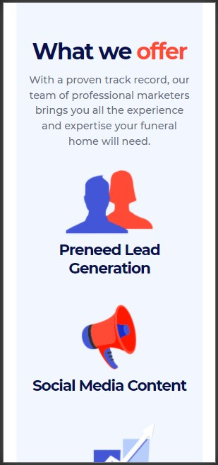
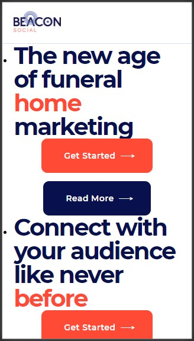
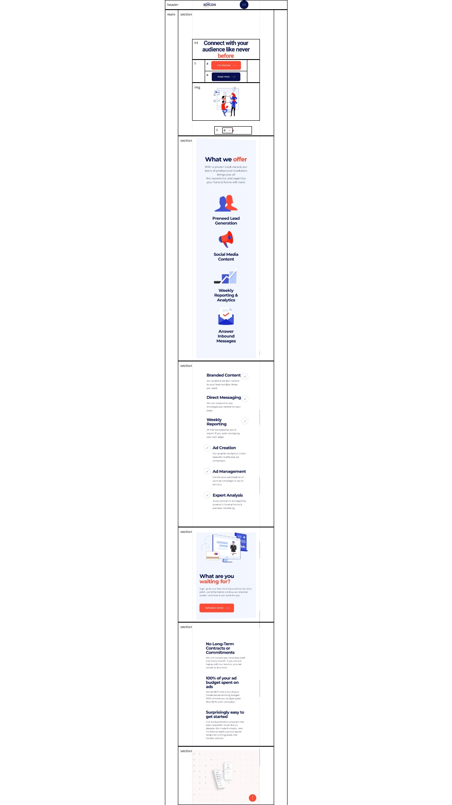

# Procesverslag
**Auteur:** Patrick van der Bijl (500823037)

## Bronnenlijst
1. https://beaconsocial.com/
2. https://css-tricks.com/

## Eindgesprek (week 7/8)

Wat heel erg goed ging was het gebruiken van animaties en de media-queries. Daarnaast ging het positioneren van de afbeeldingen uiteindelijk ook goed. Hier had ik eerst namelijk wel moeite mee. Waar ik ook erg blij mee ben is de sectie met de "vliegende" telefoon schermen, omdat deze perfect responsive is en de animatie ook goed werkt.

Wat niet goed ging was het maken van de eerste sectie, omdat ik het te moeilijk vond om een carousel te maken. Ik moet er wel bij zeggen dat ik eerst aan de slag ben gegaan met alle andere secties, zodat ik het moeilijkste als laatst kon doen. Daarnaast had ik ook wat moeite flex-box, omdat het mij niet lukte deze juist toe te passen in de footer. Ik wilde graag dat de balk met copyright erin helemaal in zijn volledige breedte onderaan de pagina staat.

**Screenshot(s):**

Hierboven zijn een aantal screenshots te zien van mijn nagemaakte website van Beacon Social. Het zal niet identiek zijn aan de originele website van Beacon Social, omdat ik vond dat er een aantal dingen anders en mooier gedaan konden worden.

**Screenreader**

Tijdens het gebruiken van de screenreader ben ik erachter gekomen dat ik sommige "alt" teksten op een andere manier moest verwoorden zodat het voor blinde mensen makkelijker te begrijpen is. Daarnaast heb ik ervoor gezorgd dat elke section in ieder geval begint met een koptekst (h1, h2, h3, enz..), zodat deze altijd als eerste wordt voorgelezen en de gebruiker begrijpt bij welke section hij/zij dan is.
Ik ben er ook achter gekomen dat ik eigenlijk aria-hidden="true" zou moeten toepassen op de "ul's" en "li's", omdat deze steeds opnieuw worden voorgelezen, wat heel erg lang kan duren.

## Voortgang 3 (week 6)

### Stand van zaken

In deze week heb ik niet heel veel progressie gemaakt, omdat ik druk bezig was met de andere vakken. Ik ben wel al verder gegaan met de 2e sectie van de home-pagina. Ik ben van plan om in de vakantie hiermee verder te gaan.

**Screenshot(s):**

Hierboven zie je de 2e sectie van de home-pagina. Verder ben ik nog niet gekomen.

### Agenda voor meeting

| Midas          | Moon            | Patrick         |
| ---            | ---             | ---             |
| Basis code     | Basis code      | Code check      |
| check          | check           |                 |

### Verslag van meeting

Met deze meeting heb ik zoals met elke meeting even een code check gedaan van de nieuwe code die ik getypt had. Deze was over het algemeen goed, al was het niet erg veel. Ik heb verteld dat ik in de vakantie verder ga werken en dus ook een begin ga maken met de about-pagina.

## Voortgang 2 (week 5)

### Stand van zaken

Deze week ben ik verder gegaan met het maken van de eerste sectie van de home-pagina. Het is met gelukt om alles in correct semantisch html te zetten alleen heb ik wel wat moeite met het positioneren van de elementen. Vooral de afbeeldingen zijn lastig om te positioneren aangezien ze ook een animatie nodig hebben.

**Screenshot(s):**

Hierboven zie je wat ik tot nu toe van de home-pagina heb kunnen maken.

### Agenda voor meeting

| Midas          | Moon            | Patrick         |
| ---            | ---             | ---             |
| Basis code     | Hover state     | Code check,     |
| check          | en html code    | positioneren    |
|                |                 | en animeren     |

### Verslag van meeting

Tijdens deze meeting heb ik weer even nagevraagd of mijn code correct is. Gelukkig was dit wel het geval. Echter had ik wel moeite met het positioneren van de afbeeldingen in de eerste sectie. Ik kwam er maar niet uit hoe ik deze het best boven elkaar kon zetten en ook nog eens kon animeren. Hier heb ik dus even hulp om gevraagd. Sanne gaf aan dat ik in dit geval wél een "div" kon gebruiken om de afbeeldingen te groeperen, zodat ik ze makkelijker kan positioneren. Dit geld dan voor de "div" zelf en de afbeeldingen in de "div". Daarnaast heeft Sanne mij geholpen met het animeren van de afbeeldingen. Deze moeten namelijk "infaden" wanneer de pagina wordt geladen.

## Voortgang 1 (week 3)

### Stand van zaken

Aangezien ik nog niet heel veel code had geschreven waren er ook niet veel opmerkingen. Wat goed ging tot aan dit eerste voortgangsgesprek was het maken van de html structuur. Waar ik nog wel een beetje moeite mee had was het gebruiken van flex voor de responsiveness, omdat ik hier nog niet zo bekend mee ben.

**Screenshot(s):**

Voor dit eerste voortgangsgesprek was ik alleen nog toe gekomen aan de header en de eerste section. Hierboven zie je het resultaat tot nu toe.

### Agenda voor meeting

| Midas          | Moon            | Patrick      |
| ---            | ---             | ---          |
| Basis code     | Grid en         | Code check   |
| check          | responsiveness  | en opdracht  |

### Verslag van meeting

Met deze eerste meeting had ik niet veel vragen. Ik was namelijk nog niet zo heel ver en had alleen de html code en een beetje css geschreven. Daarom wilde ik alleen mijn code laten nakijken of het semantisch correct is en wat er eventueel beter kan. Daarnaast had ik nog wat vragen over de opdracht. Ik vroeg me af of de afmetingen die ik op mijn website heb, exact hetzelfde moeten zijn als de website die ik na maak. Dit was uiteindelijk niet nodig, want je mag zelfs een aantal dingen veranderen aan de website als je vindt dat het beter kan.

## Breakdownschets (week 1)

## Intake (week 1)

**Je startniveau:** Rood

**Je focus:** Responsive

**Je opdracht:** https://beaconsocial.com/

**Screenshot(s) van de eerste pagina (small screen):**

**Screenshot(s) van de tweede pagina (small screen):**

